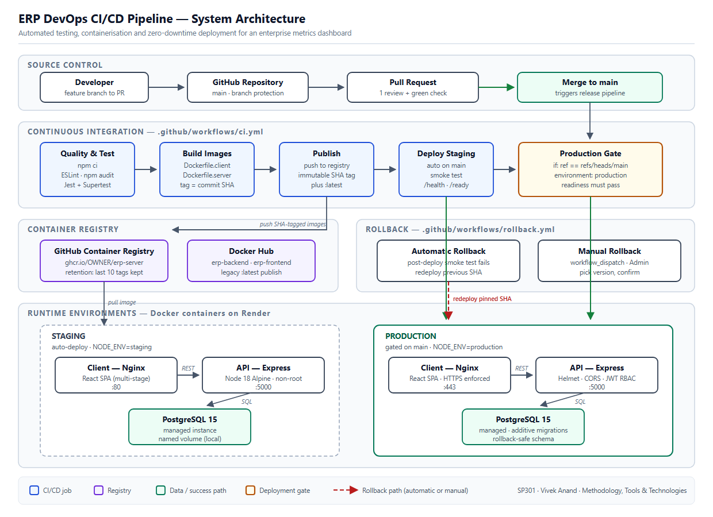

# SP301 — ERP DevOps CI/CD Pipeline

An ERP operations dashboard (Sales, Inventory, People, Finance) delivered by a
CI/CD pipeline that tests, containerises, gates and records every release, with
role-based access control, feature flags and a documented rollback path.

## The problem

Releasing an ERP application by hand is risky. Environments drift between
laptops and servers. Untested builds reach production. Database changes break
the version you need to roll back to. Too many people can change things they
shouldn't. This project shows one working answer: every change goes through the
same automated checks, ships as an immutable container image, is blocked from
production unless it proves it is healthy, and leaves a record. Access to data
and controls is enforced on the server according to the user's role.

## Architecture

```
 Browser ──► client (nginx :8080, React build)
                 │  /api, /health, /ready proxied
                 ▼
            server (Node/Express :5000) ──► db (PostgreSQL 15)
                 ▲
 GitHub Actions ─┘  POST /api/deployments (X-Deploy-Token)
```



| Part | What it does | Where |
|---|---|---|
| Dashboard | Overview, Sales, Inventory, People, Finance, Deployments, Feature flags | `client/src` |
| API | Auth, RBAC, metrics, employees, reports, flags, deployments, status | `server/` |
| Database | Schema files applied in order by a migration runner; demo data seeded into empty tables | `server/db` |
| Pipeline | Test → audit → build images → readiness gate → gated production deploy → record outcome | `.github/workflows/ci.yml` |
| Rollback | Manually started; re-points `:latest` to an earlier image, redeploys, smoke-tests, records it | `.github/workflows/rollback.yml` |
| Retention | Keeps the last 20 SHA-tagged images, so rollback targets exist | `.github/workflows/registry-retention.yml` |

## Roles and access

Enforced on the server (`server/middleware/auth.js`). The UI only hides what the
server would refuse anyway.

| Capability | Admin | Manager | Employee |
|---|:--:|:--:|:--:|
| Sales and Inventory metrics | ✓ | ✓ | ✓ |
| People (HR) and Finance metrics | ✓ | ✓ | — |
| Executive summary (`/api/reports/summary`) | ✓ | ✓ | — |
| View employees | ✓ | ✓ | — |
| Add employees | ✓ | — | — |
| Deployment history | ✓ | ✓ | — |
| View and change feature flags | ✓ | — | — |
| System runtime stats (`GET /api/metrics`) | ✓ | — | — |

Self-registration always creates an Employee. Only a signed-in Admin can
create a Manager or Admin. No token gives **401**; the wrong role gives
**403**. Full matrix: [docs/ACCESS_MATRIX.md](docs/ACCESS_MATRIX.md).

## Run it locally

Requires Docker Desktop.

```bash
cp .env.example .env          # then edit the CHANGE_ME values
docker compose up -d --build
docker compose ps             # db, server, client should all be "healthy"
```

Open http://localhost:3000. On first start the server creates demo accounts and
fills empty tables with generated sample data. The dashboard header labels this
as **Demo data**.

| Account | Password | Role |
|---|---|---|
| admin@erp.local | Admin123! | Admin |
| manager@erp.local | Manager123! | Manager |
| user@erp.local | User123! | Employee |

These passwords are public, so demo accounts are **never created in production**
unless `SEED_DEMO_USERS=true` is set explicitly.

**Port 5432 already taken?** If you have a native PostgreSQL installed, set
`DB_PORT=5544` in `.env`. On Windows, connect from the host with `127.0.0.1`,
not `localhost`.

**Starting over:** `docker compose down -v` deletes the database volume and
all its data. The next start recreates and reseeds it.

## Database: fresh installs and updates

Schema lives in `server/db/NN_name.sql`, applied in filename order by
`server/db/migrate.js`:

- Runs automatically on server start (`MIGRATE_ON_START`, default on), or on
  demand with `cd server && npm run migrate` (uses `DATABASE_URL`).
- Each file runs in a transaction and is recorded in `schema_migrations` with a
  checksum. Re-running is a no-op.
- A Postgres advisory lock stops two instances migrating at once.
- **Refuses** destructive SQL (`DROP`, `RENAME`, column type changes,
  `TRUNCATE`). During a rollback the previous version runs against the same
  schema, so changes must be additive
  ([docs/MIGRATION_SAFETY.md](docs/MIGRATION_SAFETY.md)).
- **Refuses** to continue if an already-applied file was edited. Fix forward
  with a new file.
- If a migration fails, `/ready` returns 503, so the deploy gate blocks
  that release.

**Updating an existing hosted database** (for example Render Postgres created
before the runner existed):

1. Take a backup or snapshot from the provider dashboard.
2. Run `DATABASE_URL=<hosted url> npm run migrate` from `server/`, or just
   deploy: the server migrates on start. All existing files are idempotent, so
   on a database that already has them they re-apply as no-ops and are recorded.
3. Check `GET /ready` returns 200 and `schema_migrations` lists every file.

To add a schema change: create the next numbered file, keep it additive
(`ADD COLUMN ... NULL` or with a default, `CREATE TABLE IF NOT EXISTS`), and
never edit a file that has already been applied.

## Tests

```bash
cd server && npm test                                 # API, RBAC, data, auth (in-memory store)
cd client && CI=true npx react-scripts test --watchAll=false
cd client && CI=true npx react-scripts build          # production build
cd server && npm audit --omit=dev
```

Server tests use the in-memory store, so they need no database. The CI
readiness gate repeats the important checks against a real PostgreSQL.

## CI/CD pipeline

`ci.yml` runs on every pull request and every push to `main`:

1. **quality-and-test**: install, `npm audit`, server test suite.
2. **readiness-gate** (pull requests and `main`): starts PostgreSQL, applies
   migrations (and checks a second run is a no-op), proves a forced failure
   returns 503, boots the API, waits for `/ready` = 200, then smoke-tests
   login, RBAC and seeded data.
3. **publish-ghcr** (`main` only): builds server and client images tagged with
   the commit SHA. Version, commit, branch and build time are stamped into the
   server image, and `/api/status` reports them.
4. **deploy-production** (`main` only): needs both jobs above, and the GitHub
   `production` environment can require a reviewer. It triggers the Render deploy
   hook, smoke-tests `/ready`, and records the outcome (success or failure)
   through `POST /api/deployments`.

The deploy record endpoint accepts only CI (header `X-Deploy-Token`, matching
`DEPLOY_API_TOKEN`). It is separate from user login, and in staging/production
it refuses all writes if the token isn't configured.

## Rollback

Rollback is a **manual** GitHub Actions workflow (*Actions → Rollback → Run
workflow*), not an automatic action. Give it a full commit SHA and a reason. It:

1. checks the SHA-tagged images still exist in GHCR (retention keeps 20);
2. re-points `erp-server:latest` / `erp-client:latest` at them, without rebuilding;
3. triggers the production deploy hook and smoke-tests `/ready`;
4. records a `rolled_back` (or `failed`) deployment.

**Limitation:** rollback changes the application, not the database. It works
because migrations are additive, so the older version still runs on the newer
schema. Restoring data requires the provider's backup.

The dashboard's *Roll back…* control explains this, shows the commit SHA, and
links to the workflow.

## Configuration

All variables, with safe local defaults: [.env.example](.env.example).
Hosting setup (GitHub environment secrets, Render services, HTTPS):
[docs/ENVIRONMENT.md](docs/ENVIRONMENT.md).

Required in production: `DATABASE_URL`, `JWT_SECRET` (the server refuses to
start with the development default), `DEPLOY_API_TOKEN`,
`CORS_ALLOWED_ORIGINS`. Required as GitHub `production` environment secrets:
`RENDER_DEPLOY_HOOK`, `APP_BASE_URL`, `DEPLOY_API_TOKEN`.

## Security

Non-root containers, Helmet headers, strict CORS allow-list, HTTPS redirect in
production, failed-login throttling (10 attempts per email and IP per 15 minutes),
bcrypt password hashes, parameterised SQL everywhere, request-size
limits, no internal error text in API responses. Details:
[docs/HARDENING.md](docs/HARDENING.md).

## Known limitations

- Production deploy, rollback and GHCR retention need the GitHub `production`
  environment, its secrets and the Render services. They are written and
  reviewed, but have not run against a live host yet.
- Business figures are generated sample data until real data is loaded
  (`SEED_DEMO_DATA=false`).
- The client production build's `npm audit` reports issues in `react-scripts`
  build tools. They are build-time only: the shipped image serves static files
  from nginx. Fixing them means migrating off Create React App.
- Invoices and orders can be created through the API, but the dashboard has no
  create forms. It is a monitoring view.

## Further documentation

| Document | Covers |
|---|---|
| [docs/ACCESS_MATRIX.md](docs/ACCESS_MATRIX.md) | RBAC per route, feature-flag evaluation |
| [docs/DEPLOY_GATING.md](docs/DEPLOY_GATING.md) | How the readiness gate blocks a bad build |
| [docs/MIGRATION_SAFETY.md](docs/MIGRATION_SAFETY.md) | Why migrations must be additive |
| [docs/REGISTRY_RETENTION.md](docs/REGISTRY_RETENTION.md) | Image retention for rollback |
| [docs/HARDENING.md](docs/HARDENING.md) | Security hardening |
| [docs/ENVIRONMENT.md](docs/ENVIRONMENT.md) | Variables and hosting setup |
| [docs/DEMO.md](docs/DEMO.md) | Presentation script |
| [docs/WORK_AND_DEPENDENCIES.md](docs/WORK_AND_DEPENDENCIES.md) | Who built what |
