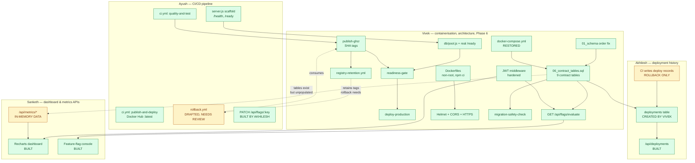

# Work Completed & Dependency Map — Vivek Anand

**SP301 · ERP DevOps CI/CD Pipeline**
**Branch:** `integration/week13-merge` (my 6 commits + `main` + Sanketh's week 13) · 67/67 server tests passing, client builds
**Compiled:** 30 September 2026 · **Updated:** 2 October 2026 after integrating Akhilesh's and Sanketh's Sep 30 work

My workstream: *Methodology, Tools & Technologies* (report) and
*Containerisation (Docker/Compose) & System Architecture* (build), plus Phase 6
lead for Access Control & Feature Flags.

---

## 1. What I completed

### Planned tasks (all six)

| Plan week | Task | Evidence |
|---|---|---|
| **3** | Architecture + environments | `docs/ENVIRONMENT.md` — 7 env vars, per-environment values, browser steps · `docs/architecture.svg/.png` |
| **4** | Production deploy gating | `docs/DEPLOY_GATING.md` — gate exits 0 healthy / 1 broken |
| **7** | Registry retention policy | `.github/workflows/registry-retention.yml` · `docs/REGISTRY_RETENTION.md` |
| **8** | Additive-migration safety | `scripts/migration-safety-check.sh` — 20/20 passed · `docs/MIGRATION_SAFETY.md` |
| **9** | RBAC + feature flags (Phase 6 lead) | `server/middleware/auth.js`, `server/routes/flags.js` — RBAC/flag suite · `docs/ACCESS_MATRIX.md` |
| **11** | Hardening pass | `docs/HARDENING.md` — non-root, audit, Helmet/CORS, HTTPS |

### Blocking defects found and fixed

These were pre-existing and had to be cleared before the planned work could run
at all. Each is worth mentioning in the viva — they are the difference between a
pipeline that looks configured and one that works.

| # | Defect | Impact | Fix |
|---|---|---|---|
| 1 | `docker-compose.yml` contained a **copy of `ci.yml`**, not Compose config (overwritten at commit `0ff40646`) | `docker compose up` failed outright; the container stack could not start | Restored from `21516668`, added named volume, healthchecks, ordered startup |
| 2 | Migrations **never ran**. `schema.sql` sorted *after* `02_employees.sql`, which references `users` | Init aborted; database was **empty** — `\dt` returned "no relations" | Renamed `schema.sql` → `01_schema.sql` (content untouched) |
| 3 | `/ready` was **fake** — hardcoded `const isDbConnected = true` | Returned `{"ready":true,"database":"connected"}` with the DB container *stopped*. Any deploy gate on it was vacuous | Wired to a real `pg` pool running `SELECT 1`; returns 503 on failure |
| 4 | `JWT_SECRET` fell back to hardcoded `dev_secret_key` in every environment | Anyone who read the repo could mint an Admin token against production | Refuses to boot in staging/production with the default |

Also fixed: `client/package-lock.json` was out of sync with `package.json`
(missing `yaml@2.9.1`), breaking `npm ci`.

### Numbers for the report

- Database went from **0 tables** to **all 9 contract tables** present on a cold boot
- Server `npm audit`: **2 vulnerabilities (1 high, 1 moderate) → 0**
- Containers: **both root → uid 1000 (`node`) and uid 101 (`nginx`)**
- Test suite: **1 vacuous test → 67 passing tests** across 7 suites (after integration)

---

## 2. What the repository shows others contributed

Stated from `git log`, so it is checkable. **Read this as commit authorship,
not effort.** Commits may have gone through a shared machine or account.

| Member | Commits | When | What is attributable |
|---|---:|---|---|
| **Ayush Krishna Behera** | 39 (incl. merges) | 19–23 Aug | Scaffold, `ci.yml`, both original Dockerfiles, original Compose file, auth middleware, employee/inventory/invoice/report/metrics routes, SQL files 02–05, Jest setup |
| **Akhilesh Mittapalli** | 5 | 18 Aug, 25 Aug, 30 Sep | Repo creation, lockfile sync, `/api/deployments` (current + paginated history + CI write), Prometheus `/metrics`, `PATCH /api/flags/:key` with audit trail |
| **Bonagiri Sanketh Kumar** | 1 | 30 Sep | Week 13 branch: Recharts dashboard (Sales/Inventory/HR/Finance), KPI cards, feature-flag console, deployment history table, `/api/metrics/{sales,inventory,hr,finance}`, query validation, seed script, 26 tests |
| **Vivek Anand (me)** | 6 + integration | 29 Sep – 2 Oct | Section 1 above, plus the integration in section 2a |

### 2a. Integration (2 October)

Akhilesh's two Sep 30 commits were pushed directly to `main` and left it
failing (2 of 3 test suites: `SyntaxError: Identifier 'express' has already
been declared`). Sanketh's branch passed on its own but conflicted with
`main` and with mine. On `integration/week13-merge` I kept each person's
intent and fixed what stopped it running:

| Problem | Fix |
|---|---|
| A second Express app pasted after `module.exports` in `server.js` | Removed; `/api/deployments` and Prometheus `/metrics` mounted on the real app |
| `users` table deleted from `01_schema.sql` (`02_employees.sql` depends on it) | Restored; `deployments`/`audit_log` already live in `06_contract_tables.sql` |
| `authorizeRoles` renamed to `requireRole`, so three route files lost their import | Kept `authorizeRoles`; added `requireRole` as an alias |
| `require('../db')` and `../controllers/deploymentsController` don't exist | Pointed at `db/pool`; flag audit writes to `flag_events` + `audit_log` |
| Two competing `flags.js` | One file: my `evaluate` + Akhilesh's `PATCH` |
| `POST /api/deployments` accepted writes from anyone | Requires `X-Deploy-Token` (`DEPLOY_API_TOKEN`) |
| `GET /api/metrics` (process memory, runtime) made public | Admin-only again, per `ACCESS_MATRIX.md` |
| RBAC tests needed a live Postgres (31/37 without it) | Pool stubbed with the seeded rows; `TEST_LIVE_DB=1` runs live |
| No rollback workflow | `.github/workflows/rollback.yml` drafted in Ayush's lane for his review |

### 2b. Still open

| Item | Owner | Status |
|---|---|---|
| Sales/inventory repositories are **in-memory**, not Postgres | Sanketh | ⚠️ Data lost on restart; tables exist in `06_contract_tables.sql` |
| `/api/metrics/{sales,…}` have no auth | Sanketh / team | ⚠️ Dashboard sends no token; decide whether these are public |
| `ci.yml` does not yet POST deploy records | Akhilesh | ⚠️ Endpoint exists; only `rollback.yml` calls it |
| `/api/deployments/current` reads env vars nothing sets | Akhilesh | ⚠️ Returns defaults until CI injects `APP_VERSION`/`COMMIT_SHA` |
| Review and own `rollback.yml` | Ayush | ⚠️ Drafted, not yet run on GitHub |
| Auth users are an in-memory array | Ayush | ⚠️ The `users` table is unused |

## 3. Interconnection map

**Reading it:** green = built and verified, red = not built, amber = partially
there. Solid arrows are hard dependencies; dotted arrows are consumption
relationships that will matter once the red boxes exist.

---

## 4. Dependencies

### 4a. What I depended on — all resolved

| I needed | From | How it was resolved |
|---|---|---|
| Express app with `/health`, `/ready` | Ayush | Existed; I replaced the fake `/ready` body with a real DB probe |
| `ci.yml` to extend | Ayush | Existed; I **appended only** — his 7 steps verified byte-identical |
| Base SQL schema | Ayush | Existed but never applied; I fixed the ordering bug |
| Working Dockerfiles | Ayush | Existed; I hardened them (non-root, `npm ci`, dumb-init) |

**Nothing blocked me.** Every dependency was either already present or was a
defect I could fix inside my own remit.

### 4b. What others now depend on from me — all delivered

| They need | Who | Delivered |
|---|---|---|
| Working local stack (`docker compose up`) | All three | ✅ Boots clean from cold, all 3 containers healthy |
| Database with real tables | Sanketh, Akhilesh | ✅ All 9 contract tables auto-apply on boot |
| `deployments` table to write into | Akhilesh | ✅ Created and indexed |
| `feature_flags` + `flag_events` tables | Ayush | ✅ Created, seeded, indexed |
| JWT middleware to protect routes | All three | ✅ Hardened; role claim enforced server-side |
| SHA-pinned images to roll back to | Ayush | ✅ `publish-ghcr` job + 20-tag retention |
| Gated production deploy | Ayush | ✅ Three-way gate on `main` |

### 4c. What is still blocked — and on whom

Superseded by **2b. Still open** above: rollback, deployment history, the
metrics APIs, the dashboard and the flag toggle now all exist on
`integration/week13-merge`. What remains is persistence and CI wiring.

### 4d. Blocked on me — action items for Vivek

| Item | Detail |
|---|---|
| Push the branch / raise the PR | `integration/week13-merge` — merge into `main` once reviewed |
| **Fix git author identity first** | Commits are authored `parmanand.s@bigstrum.in`, likely not the GitHub account — they will not attribute to me |
| GitHub Environments + secrets | Create `staging` / `production`, add `DATABASE_URL`, `JWT_SECRET`, `RENDER_DEPLOY_HOOK`, `APP_BASE_URL` — `docs/ENVIRONMENT.md` §2 |
| Render services + Postgres | Two web services, two managed databases, copy deploy hooks — §3 |
| GHCR package permissions | Grant Actions **Write** on `erp-server` and `erp-client`, or the retention job 403s |
| Confirm Phase 6 / Phase 7 leads | The plan defaults me → Phase 6, Sanketh → Phase 7; the team was meant to confirm before Week 9 |

---

## 5. Verification status

| Claim | How verified | Confidence |
|---|---|---|
| Stack boots clean from cold | `docker compose down -v` then `up --build`; 3/3 healthy | **Verified locally** |
| All 9 contract tables on cold boot | `information_schema` query after fresh volume | **Verified locally** |
| `/ready` genuinely probes the DB | Stopped the DB container → 503; `/health` stayed 200 | **Verified locally** |
| Deploy gate blocks a bad build | Gate loop: exit 0 healthy, exit 1 on forced failure | **Verified locally** |
| Old + new versions coexist on one schema | Both images live simultaneously; 20/20 assertions | **Verified locally** |
| RBAC matrix correct for 3 roles | Jest access-matrix suite + live HTTP per role | **Verified locally** |
| Containers non-root | `docker exec <c> id` before and after | **Verified locally** |
| Helmet / CORS / HTTPS redirect | Live header inspection; 308 under `NODE_ENV=production` | **Verified locally** |
| Gate blocks on **live GitHub Actions** | — | ⚠️ **Not yet** — needs a push |
| HTTPS on **live hosted** environments | — | ⚠️ **Not yet** — neither environment provisioned |

The two ⚠️ rows are the honest limit of what can be shown from a local
repository. Both resolve as soon as the branch is pushed and Render is set up.

---

## 6. Suggested talking points for the viva

1. **Why a readiness probe must be able to fail.** `/ready` returning
   "connected" with the database stopped is the clearest example in this project
   of a check that provides false assurance. Gating a deploy on it would have
   promoted every broken build.
2. **Why rollback constrains registry retention.** Rollback redeploys a *pinned
   tag* rather than rebuilding, so image retention stops being housekeeping and
   becomes a correctness requirement — delete the artefact and the rollback
   becomes an outage.
3. **Why migrations must be additive.** During a rollback window both versions
   run against one schema. A rename or a `NOT NULL` without a default turns a
   30-second recovery into a second incident. Demonstrated concretely with
   `scripts/migration-safety-check.sh`.
4. **Why RBAC is enforced server-side.** Hiding a button is not access control;
   every row of the access matrix is asserted against a real JWT.
